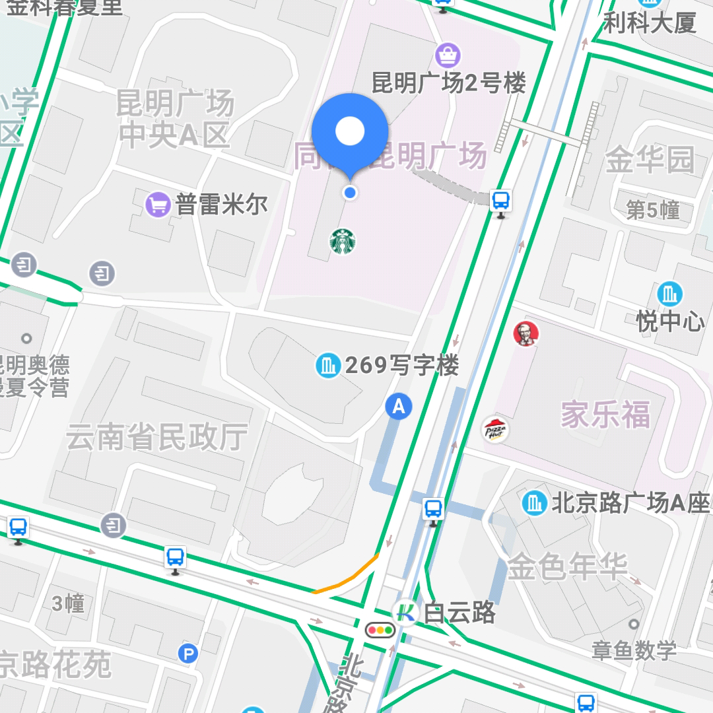

# 一切如常

2020高中生音乐节  
This project contains resources like business card design files. Reserved for further use.


## Before we get started

如果没有使用科学上网，图片可能无法显示。别担心，__这不会影响你的任何操作__。

## 演出详细信息

演出地点未定，敬请期待
<!---->

### 演出时间:

2020年8月16日与17日
预计开始于 19:30

### 演出地点:

可能是摩登天空?
现在我们也不知道.
<!--~~昆明市盘龙区北京路与白云路交叉口 同德广场-悦汇坊 B1楼06号~~
-->

### 出演乐队：

  

8月16日:
* BurningFantastic
* 翠Emerald
* Atlantis
* Anonymous
* AURORA
* pseudoscience

  
  
8月17日:
* △Delta
* ScrapeTogether
* 逃逸速度
* free+∞ 无限自由
* Underskin
* 拾贰

### 乐队简介

见购票页面

## 购票与定价

| 票种          | 价格           |
| ------------- |:-------------:|
| __预售单日票__ | __50 CNY__    |
| __现场单日票__ | __60 CNY__    |
| __预售通票__   | __90 CNY__    |


~~__购票二维码(Not avalible)：__~~


~~__购票链接：__  [NotAvalible](https://www.showstart.com/event/113254?ssfrom=yp-zyb)  ~~
  
~~你也可以手动复制链接来访问购票网站: 
```https://www.showstart.com/event/113254?ssfrom=yp-zyb```~~  
